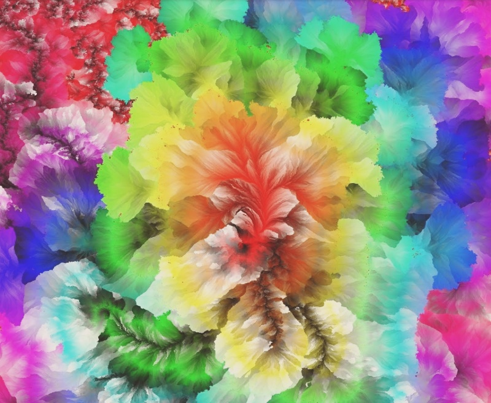
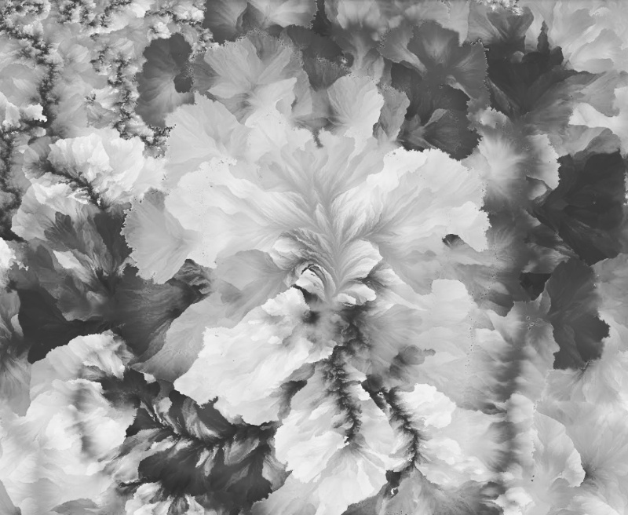

[](https://img.shields.io/pypi/pyversions/instafilter.svg)
[](https://pypi.python.org/pypi/instafilter)

Modifiy images using Instagram-like filters in python.

    pip install instafilter

Example:

``` python
from instafilter import Instafilter

model = Instafilter("Lo-fi")
new_image = model("myimage.jpg")

# To save the image, use cv2
import cv2
cv2.imwrite("modified_image.jpg", new_image)
```

## Sample images

Browse samples for every filter in [`development/examples`](development/examples).

**Ludwig**
[](examples/Ludwig.jpg)

**Stinson**
[](examples/Stinson.jpg)

**Moon**
[](examples/Moon.jpg)

## Train

See the code in [`development/train_new_model`](development/train_new_model) to train a new model.

## Roadmap

+ Medium post

## Credits

+ Made with ❤️ by [Travis Hoppe](https://twitter.com/metasemantic?lang=en).

+ Header image sourced from [Will Terra](https://unsplash.com/photos/qIY9mUKT540) and modified with instafilter.