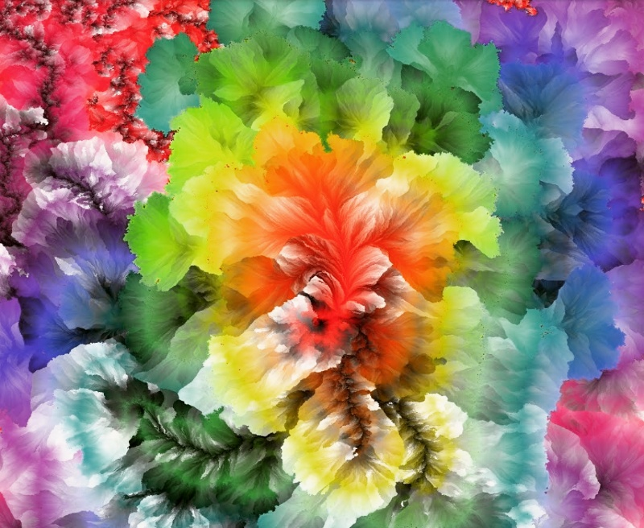

# instafilter
Instagram-like filters with deep learning

    pip install instafilter


``` python
from instafilter import Instafilter

model = Instafilter("Lo-fi")
new_image = model("myimage.jpg")
```

**Ludwig**
[](examples/Ludwig.jpg)

**Stinson**
[](examples/Stinson.jpg)

**Moon**
[](examples/Moon.jpg)


See the code in [`train`](`train') to train a new model.

## Roadmap

+ Publish on pypi
+ Medium post
